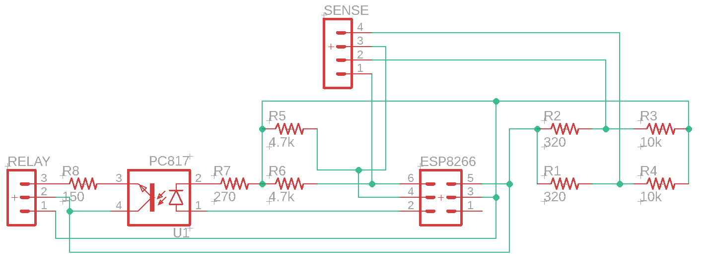

# ESP8266 Garage Server

This is intended for use with a Homebridge server which interacts with this 'API'. My implementation can be found at [WillStOnge/homebridge-garagedoor-esp8266](https://github.com/WillStOnge/homebridge-garagedoor-esp8266)

## Configuration
There isn't too much to configure. All you need to do is enter your network SSID and password into the define statements on lines 14 and 15. If you want the relay to remain on for more/less time, this can be altered on line 11 (time is in milliseconds). Also, make sure that your relay and sensors are on the same GPIO lines as described on lines 7, 8, and 9.

## Wiring Diagram
I used an ESP8266 develoment board and some blank PCBs for ease of soldering.

This is the schematic for this setup:

It doesn't include the ESP8266, but the GPIO lines are clearly labeled. When attaching to your garage, make sure your lines are not backwards or the door will not open/close.
